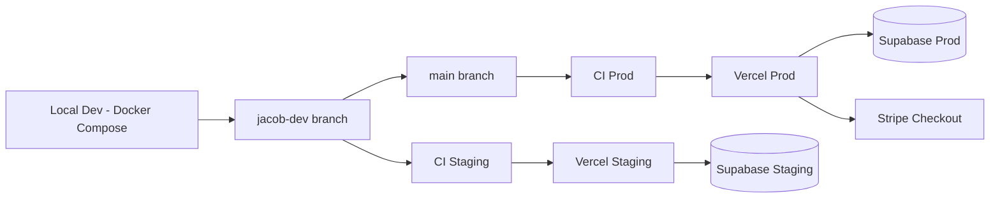
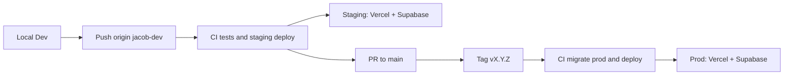

# [ARCHITECTURE.md](http://architecture.md/) — Real Deal Kickz

> Scope: End-to-end architecture across all phases (MVP → Post-MVP → Scaling → Intelligence → Maintenance), with a three-tier environment model, explicit application layers, versioned migrations, and multi-tenant-ready design.
> 

---

## 0) System Overview (All Phases)

- **App Framework:** Next.js (App Router) with Server Actions & Route Handlers (API inside Next.js)
- **Data & Auth:** Supabase (Postgres, Auth, RLS, Storage)
- **Payments:** Stripe Checkout (Apple Pay at MVP; Google Pay/Link post-MVP)
- **Hosting:** Vercel (global edge)
- **Environments:** Three-tier model
    - **Local Dev:** Fast iteration, Stripe test keys, local or staging Supabase.
    - **Staging:** Hosted, prod-like; full integration/load/security tests.
    - **Production:** Locked-down, tag-only deploys with SLOs & alerting.
- **Proxy:** Caddy (local/dev now; optional dedicated VM Phase 3+)
- **CI/CD:** GitHub Actions → Vercel deploy + Supabase migrations
- **Monitoring & Analytics:** Sentry, PostHog, Vercel Analytics
- **Target Cost:** $0–$30/month early phases; Supabase Pro + staging project, no DB sprawl.



### Phase Evolution Overview

To keep long-term architecture sane, every major component has an explicit phase trajectory:

- **MVP (Phase 1):**
    - Single-tenant posture (but schema is multi-tenant ready).
    - Core catalog, orders, RLS, Stripe Checkout, basic ISR caching, metrics (vistors last 30 days & revenue).
    - Inline jobs running in API routes.
    - Basic rate limiting & security headers.
    - Staging environment fully used for regression & integration tests.
- **Post-MVP (Phase 2):**
    - Sentry + PostHog fully wired with alerts.
    - Admin audit logs.
    - Session hardening & SEO improvements.
- **Scaling (Phase 3):**
    - Background workers behind Caddy.
    - Cloudflare R2 image offload (optional).
    - Full edge rate limiting, bot filtering, and load testing in staging.
    - Backup verification and migration governance tightened.
- **Intelligence (Phase 4):**
    - ML-ready schema and events.
    - Abandoned cart analytics and customer insights dashboards.
    - Developer observability portal tying logs, traces, metrics together.
- **Maintenance (Phase 5):**
    - Security patch cycles, monthly uptime/perf reports.
    - Optional headless CMS for content.
    - Periodic dependency and infra refresh.

---

## 1) Repository & Project Boundaries

**Repo Model:** Single monorepo (app + infra + CI).

### High-Level Layout

```bash
/ (repo root)
├─ app/                        # Next.js (routes, UI, route handlers)
/src
├─ src/config/
│  └─ env.ts                   # Zod-based env validation module
├─ src/lib/
│  ├─ supabase.ts              # Supabase client wiring
│  ├─ stripe.ts                # Stripe SDK wiring
│  ├─ cache.ts                 # Cache helpers (tags, headers)
│  └─ log.ts                   # Structured logging + request IDs
├─ src/repositories/           # Data access layer (Supabase queries)
├─ src/services/               # Domain logic layer
├─ src/jobs/                   # Backgroundable workflows (Stripe, emails, etc.)
├─ src/middleware/             # Edge middleware (rate limits, auth hardening)
├─ infra/
│  ├─ Caddyfile
│  └─ docker/
│     ├─ compose.yml
│     └─ Dockerfile
├─ supabase/
│  └─ migrations/              # Versioned SQL migrations (single source of truth)
├─ .github/workflows/          # CI/CD
├─ docs/                       # SYSTEM_PLAN, RUNBOOK, ARCHITECTURE, SECURITY, etc.
└─ .env.example                # Example configuration (no secrets)

```

### Rationale

- Keeps **data access**, **business logic**, and **jobs** separate from routing/UI.
- Makes it easy to add dedicated workers later without rewriting business logic.
- Provides a natural seam for RLS enforcement and multi-tenant rules in repositories.
- Centralizes env/config and logging so infra concerns don’t leak into business code.

---

## 2) Environment & Deployment Model (Three-Tier)

### 2.1 Environments

| Env | Purpose | Runtime | Data Source |
| --- | --- | --- | --- |
| Local Dev | Fast iteration, debugging | Docker Compose / `npm run dev` | Local Supabase *or* Staging Supabase |
| Staging | Prod-like integration & load | Vercel (staging project/env) | Supabase Staging project |
| Prod | Customer-facing, locked down | Vercel (prod project/env) | Supabase Prod project |

**Key Rules**

- **Same schema & migrations** for staging and prod: both run off `supabase/migrations/*`.
- Staging uses **Stripe test mode**; prod uses **Stripe live**.
- Only **tagged commits (`v*`)** may deploy to production.
- Branches:
    - **`jacob-dev`**: active development, staging deploys.
    - **`main`**: production branch; release tags cut from `main`.



### Performance SLOs

- **TTFB:** < 200ms for cached pages and assets.
- **FCP (First Contentful Paint):** < 2s for product pages on a typical connection.
- **Checkout success rate:** ≥ 98% (Stripe Checkout end-to-end).
- These SLOs apply to both **staging and production**. Staging is the proving ground; prod is not allowed to drift.

---

## 3) Configuration & Env Validation

Centralized configuration lives in **`src/config/env.ts`**.

- Uses **Zod** to validate environment variables at:
    - Build time (Next.js build).
    - Runtime (server boot).
    - CI jobs (env validation step).
- Exposes a typed `env` object:
    - `env.SUPABASE_URL`
    - `env.SUPABASE_SERVICE_ROLE_KEY`
    - `env.STRIPE_SECRET_KEY`
    - `env.SENTRY_DSN`
    - `env.UPSTASH_REDIS_REST_URL`
    - etc.

Benefits:

- Prevents “works locally, explodes in prod” due to missing/mis-typed env.
- Enforces parity between **local**, **staging**, and **prod** configuration shape.
- New required env vars are added in exactly one place.

### Session & Cookie Security

Session behavior is constrained by security posture:

- **Admin sessions expire on browser close** (non-persistent).
- Session cookies:
    - `HttpOnly`
    - `Secure`
    - `SameSite=Strict` (unless a Stripe/Auth edge case requires relaxation).
- Production enforces HSTS and CSP as defined in `SECURITY.md`.
- Session inactivity timeout: 30–60 minutes recommended; refreshed on activity.

---

## 4) Runtime Architecture & Application Layers

All application logic is hosted inside **Next.js App Router**, but internally the app is layered.

### 4.1 Route Handlers (Thin Controllers)

Location: `app/api/**/route.ts`

Responsibilities:

- HTTP concerns (routing, status codes).
- Input parsing/validation (Zod schemas or equivalent).
- Enforcing auth (role, tenant, user).
- Delegating to **services/jobs**.
- Never directly calling Supabase; always go via repositories.

### 4.2 Services (Domain Logic Layer)

Location: `src/services/**`

Examples:

- `OrderService`:
    - create/confirm/cancel orders.
    - calculate platform/applicable fees (non-tax).
    - orchestrate inventory updates.
- `CatalogService`:
    - search, filters, and catalog queries.
    - variant resolution.
- `AdminService`:
    - product CRUD.
    - inventory adjustments.
    - higher-risk actions logged to admin audit log.

Responsibilities:

- Express **business rules and workflows**.
- Compose repositories + Stripe + jobs.
- Stay agnostic to HTTP (usable from jobs, not just route handlers).

### 4.3 Repositories (Data Access Layer)

Location: `src/repositories/**`

Responsibilities:

- Encapsulate **all Supabase queries**.
- Apply **tenant/seller context** automatically where relevant.
- Provide a **narrow, composable interface** for services.
- Enforce RLS assumptions: no direct service-role usage in untrusted contexts.

### 4.4 Jobs (Backgroundable Workflows)

Location: `src/jobs/**`

Examples:

- `StripeOrderJob`: process Stripe webhooks, finalize orders.
- `CacheInvalidationJob`: call `revalidateTag` / `revalidatePath`.
- `EmailJob`: order confirmations, drop alerts.
- `InventorySyncJob`: reconcile stock levels.

**Runtime (MVP):**

- Jobs execute inline inside API route handlers (serverless functions).
- Idempotency is enforced at the job level where applicable.

**Evolution (Phase 3+):**

- Move heavy jobs to dedicated worker processes behind Caddy.
- Keep the code unchanged; only change where jobs are invoked.

### Worker Orchestration Model (Phase 3+)

When workers are introduced:

- A **Caddy VM** proxies traffic from worker → internal-only API routes.
- Internal endpoints are restricted via:
    - mTLS between worker and Caddy, or
    - Signed internal tokens with short TTL.
- A queue (e.g., Upstash/Redis queues) is used for:
    - Inventory reconciliation.
    - Email pipelines.
    - Stripe event retries and DLQ handling.
- Workers reuse **repositories** and **services** unchanged, preserving business logic in one place.

---

## 5) Data Model & Multi-Tenant Readiness

### 5.1 Core Tables

**products**

- `id (uuid)`
- `sku (text unique)`
- `name`, `brand`
- `tenant_id (uuid, nullable)` / `seller_id (uuid, nullable)` — multi-seller support (future)
- `size_runs (jsonb or text[])`
- `condition (enum: new|used)`
- `images (text[])`
- `price (numeric)`
- `inventory_strategy (enum: flat|per_size)`
- `created_at`, `updated_at`

**orders**

- `id (uuid)`
- `user_id (uuid, fk profiles)`
- `tenant_id (uuid, nullable)` / `seller_id (uuid, nullable)`
- `stripe_session_id (text)`
- `subtotal (numeric)`, `shipping (numeric)`, `fee (numeric)`
- `status (enum: pending|paid|shipped|canceled)`
- `created_at`, `updated_at`

**profiles / users**

- `id (uuid)`
- `email`
- `role (enum: customer|admin|ops?)`
- `display_name`, `avatar`
- `twofa_enabled (bool)`
- `created_at`

### 5.2 Multi-Tenant Strategy

- `tenant_id` / `seller_id` present from day one, **even if MVP is single-tenant**.
- Indexes on:
    - `tenant_id`
    - `seller_id`
    - `(tenant_id, created_at)` for reporting.
- RLS structured to **scope by tenant first**, then by user.
- Repository layer **auto-injects tenant context** from the authenticated session.

This design permits evolution into multi-seller marketplace without major schema surgery.

---

## 6) Payments & Order Lifecycle

Payments are handled via **Stripe Checkout**. The platform **never** stores raw card data; Stripe handles PCI.

### Flow

1. Client calls `/api/checkout` (controller).
2. Controller validates request → calls `OrderService` / `CheckoutService`.
3. Service:
    - Creates Stripe Checkout Session.
    - Persists a **pending** order record (or equivalent state) via repositories.
    - Returns session URL.
4. User completes payment on Stripe’s hosted page.
5. Stripe sends **webhook** to `/api/stripe/webhook`.
6. Webhook route handler delegates to `StripeOrderJob`:
    - Verifies Stripe signature and idempotency.
    - Confirms order and updates DB (status, amounts, identifiers).
    - Emits any necessary audit logs.
    - Calls cache invalidation job to refresh affected catalog surfaces.
    - Optionally triggers an email job.

### Tax Handling

- The platform does **not compute taxes**.
- Any tax obligations are handled externally by the client; we just store totals that Stripe returns.

---

## 7) Storage & Assets

- Product images stored in **Supabase Storage**.
- Deterministic folder structure:

```
/storage
  /products/{sku}/
    original.jpg
    thumb.jpg
    medium.jpg
    large.jpg
```

### Image Variant Pipeline

On upload:

- Validate image (size, type).
- Generate **thumb**, **medium**, and **large** variants.
- Use hashed filenames (e.g., `product-{sku}-{hash}-medium.jpg`) for immutable caching.
- Store URLs in the `images` array on `products`.

Phase 3+:

- Optionally move variant generation to **Cloudflare R2 Workers** or a similar pipeline.
- Offload storage to R2 for cost/performance improvements.
- Continue to expose a simple path-based structure to the app.

---

## 8) Caching & Performance Strategy

The caching strategy is explicit, surface-specific, and designed not to leak sensitive data.

### 8.1 Static / Catalog Surfaces

- Product lists, product detail, and marketing pages:
    - Use **ISR** with `revalidate = 60` (tunable).
    - `dynamic = "force-static"` where safe.
    - Content tagged using `revalidateTag` (e.g., `products`, `product:{id}`).

### 8.2 User-Scoped / Sensitive Surfaces

- Account pages, order history, admin panel, checkout:
    - `dynamic = "force-dynamic"`.
    - `fetchCache = "force-no-store"`.
    - HTTP `Cache-Control: no-store`.
- Prevents caching user-specific or sensitive data anywhere in the chain.

### 8.3 Assets & Images

- Product images and static assets:
    - `Cache-Control: public, max-age=86400, immutable`.
    - Content-hashed filenames ensure cache busting on deploy/update.

### 8.4 API Caching

- Public read APIs (catalog) may use short TTLs (e.g., 30s) where appropriate.
- Private APIs are set to `no-store`.

### Caching Staleness Matrix

| Action | Trigger Source | Cache Target |
| --- | --- | --- |
| Product updated | Admin CRUD | `revalidateTag('products')` |
| Inventory change | Stripe webhook | `revalidateTag('product:{id}')` |
| Global settings | Config update | `revalidatePath('/')` |

This ensures staleness is bounded by ISR windows and explicit invalidation events.

---

## 9) Edge Middleware & Rate Limiting

Edge middleware (Next.js `middleware.ts` + Upstash Redis) is used for **rate limits and abuse protection**:

Protected route families:

- `/api/*`
- `/auth/*`
- `/checkout/*`
- `/admin/*`

Baseline policy (MVP):

- **~30 requests/min per IP** (tunable) for sensitive families.
- Stricter limits for auth and checkout; more relaxed (but still bounded) for catalog APIs.

Responsibilities:

- Reject abusive traffic **before** it hits route handlers or Supabase.
- Add rate-limit headers so well-behaved clients can back off.
- Log violations using `log.ts` with a consistent request ID and metadata.

### Middleware Phase Evolution

- **MVP:**
    - Basic IP-based rate limiting.
    - Auth hardening (e.g., blocking obvious bad patterns).
- **Phase 3:**
    - Add bot filtering.
    - Geo-based rules (e.g., optional blocking certain regions if needed).
    - Adaptive rate limiting for known abusive patterns.
- **Phase 4:**
    - Behavioral anomaly detection (e.g., sudden auth failures from a user cluster).
    - Automatic “slow-path” routing for suspicious traffic.

---

## 10) Logging, Observability & Testing

### 10.1 Structured Logging & Request IDs

`src/lib/log.ts` implements structured JSON logging.

On each request:

- Generate or propagate an `x-request-id`.
- Log entries include:
    - `requestId`
    - `route`
    - `userId` (if known)
    - `tenantId` / `sellerId` (if applicable)
    - `stripeSessionId` or `stripeEventId` (for payment flows)
    - Severity, timestamp, message

This enables correlation across:

- **Vercel logs** (edge/server).
- **Supabase logs** (queries & RLS decisions).
- **Sentry traces**.
- **Stripe event logs**.

### 10.2 Monitoring Integration

- **Sentry:** error tracking, performance monitoring.
- **PostHog:** product analytics, funnels, and event tracking.
- **Vercel Analytics:** route-level performance metrics (TTFB, FCP, LCP).

### Release Tracking

Every deploy:

- Uses Git tags (`vX.Y.Z`) as Sentry release identifiers (e.g., `rdk@v0.4.2`).
- Associates error groups and performance metrics with a specific build.
- Enables clear regression investigation and post-incident auditing.

### 10.3 Load Testing (Staging)

Tools such as **Artillery** or **k6** are run against **staging**:

- Scenarios:
    - Catalog browsing.
    - Product detail views.
    - Checkout flow in **Stripe test mode**.
    - Admin CRUD operations.
    - Rate limiting and failure behavior under bursts.

Results influence indexes, caching configs, and worker offloading decisions.

### 10.4 RLS Testing

- SQL-based or scripted tests ensure:
    - Users can only see their own orders.
    - Public can only see allowed catalog data.
    - Tenant scoping works correctly when `tenant_id` / `seller_id` is present.
- These tests run in CI against a seeded staging-like DB.

---

## 11) Security Controls (Architecture-Level Summary)

Details live in `SECURITY.md`; this section is the architectural pointer.

Highlights:

- **Auth:** Supabase Auth with roles (`customer`, `admin`, optional `ops`).
- **RLS:** Enabled on `orders`, `products`, `profiles` with least-privilege policies.
- **Sessions:** Cookie-based; HTTPOnly, Secure, non-persistent for admins.
- **Webhooks:** Stripe signatures verified; idempotency enforced for state changes.
- **Headers & CSP:**
    - Strict Content-Security-Policy.
    - HSTS enabled.
    - Frame-ancestors locked down.
- **Secrets:** `.env.local` (dev), GitHub Secrets (CI), Vercel Env Vars (runtime). No secrets in git.

### Admin Audit Logs

Starting Post-MVP:

- All high-risk admin actions are logged, including:
    - Product CRUD.
    - Inventory changes.
    - Role changes / privilege escalations.
- Log entries include:
    - Admin user ID.
    - Route/action name.
    - Before/after metadata snapshots (not full PII).
    - `requestId` and timestamp.
- These logs are queryable for security reviews and incident investigations.

---

## 12) Database, Migrations & Supabase Cost Strategy

### 12.1 Versioned Migrations

- **Source of truth:** `supabase/migrations/*.sql`, timestamped and ordered.
- Change flow:
    1. Design schema changes.
    2. Generate diff via `supabase db diff` → migration file.
    3. Review & commit.
    4. CI runs **dry-run/plan** on staging.
    5. On tag `v*`, CI applies migrations to **prod** before deploying app.

Benefits:

- No schema drift between staging and prod.
- Clear audit trail of schema evolution.
- Enables safe rollback plans (paired down migrations where needed).

### 12.2 Supabase Cost Strategy

- Use **one Pro-tier Supabase project for production** and **one project for staging**.
- Avoid creating many small DBs (no DB sprawl) — complexity & drift cost more than overages.
- Accept minor Pro overages when necessary rather than fragmenting the architecture.

---

## 13) Failure Modes & Mitigations (CVL View)

A non-exhaustive but growing matrix:

| Risk / Failure Path | Layer | Mitigation / Control |
| --- | --- | --- |
| Config/env mismatch between envs | Config | `src/config/env.ts` Zod validation in CI + startup; `.env.example` kept in sync. |
| Schema drift between staging & prod | Database | Versioned migrations applied via CI on tag-only deploys. |
| Abuse / bot traffic | Edge | Upstash rate limiting on `/api`, `/auth`, `/checkout`, `/admin`. |
| RLS misconfig leaking data | Data/Auth | RLS tests, staging verification, least-privilege repository usage, no unchecked service role. |
| Multi-tenant isolation bug | Data | Tenant columns + tenant-scoped RLS + repository enforcing tenant filters. |
| Cache staleness after updates | Caching | Tag-based invalidation (`revalidateTag`, `revalidatePath`), bounded ISR windows. |
| Stripe webhook replay/forgery | Payments | Signature verification + idempotency keys; correlated logging using `stripeEventId`. |
| Missing/malformed env vars | Config | Build/startup fails fast via Zod env module + CI env validation job. |
| Load spikes causing 5xx/latency | Perf/Infra | Staging load tests; indexes + query tuning; offload heavy work to jobs/workers. |
| Session theft / fixation | Auth/Sessions | Strict cookies, non-persistent admin sessions, enforced 2FA, short inactivity timeout. |

This table is expected to grow as postmortems reveal new classes of failure.

---

## 14) Appendix — ENV Keys & Directory Cheat Sheet

### 14.1 Example ENV Keys

```bash
# Public
NEXT_PUBLIC_SUPABASE_URL=
NEXT_PUBLIC_SUPABASE_ANON_KEY=
NEXT_PUBLIC_POSTHOG_KEY=

# Server
SUPABASE_SERVICE_ROLE_KEY=
STRIPE_SECRET_KEY=
STRIPE_WEBHOOK_SECRET=
SENTRY_DSN=
UPSTASH_REDIS_REST_URL=
UPSTASH_REDIS_REST_TOKEN=
NODE_ENV=production
DEBUG=false

# Future Intelligence (Phase 4+)
INSIGHTS_API_KEY=
ABANDONED_CART_WEBHOOK_URL=

```

### 14.2 Directory Cheat Sheet

```
app/                     # Routes, UI, route handlers
src/config/env.ts        # Env validation (Zod)
src/lib/log.ts           # JSON logs + request IDs
src/lib/supabase.ts      # Supabase client wiring
src/lib/stripe.ts        # Stripe SDK wrapper
src/lib/cache.ts         # Cache/tag utilities
src/repositories/        # All Supabase access (RLS-aware)
src/services/            # Business logic & workflows
src/jobs/                # Backgroundable workflows
src/middleware/          # Edge middleware (rate limits, auth)
supabase/migrations/     # Schema history (SQL)
docs/*.md                # System, infra, security, runbook, etc.
infra/                   # Docker, Caddy, compose configs
.github/workflows/       # CI/CD

```

> Authoritative Decisions (current):
> 
> - Three-tier env: Local, Staging, Production.
> - Single monorepo with layered app architecture (repos + services + jobs).
> - Versioned Supabase migrations as schema source of truth.
> - Multi-tenant-ready schema with optional `tenant_id` / `seller_id`.
> - Explicit caching + edge rate limiting + structured logging.
> - Supabase cost strategy: one Pro-tier prod DB + one staging DB, no extra DBs.
> - Release tracking tied to Git tags in Sentry.
> - Admin audit logging from Post-MVP onward.