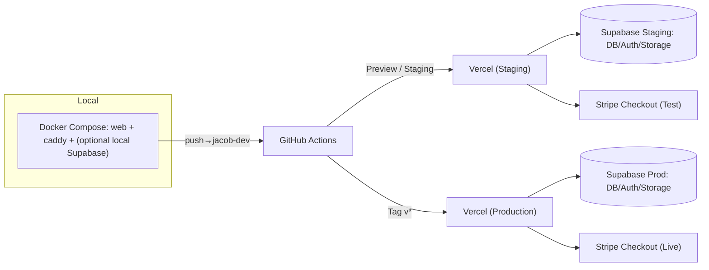

# INFRA_GUIDE.md — Realdealkickz

> Purpose: Operational and deployment infrastructure reference for the Real Deal Kickz platform. Covers local, staging, and production setup; environment variable management; networking; migrations; and backup strategy.
> 

---

## 1) Infrastructure Overview

| Layer | Role | Hosting | Key Tech | Notes |
| --- | --- | --- | --- | --- |
| **Frontend & API** | Public web and API | Vercel | Next.js (App Router) | CI/CD auto-deploy on **tags** (prod) and branches (staging/previews) |
| **Database & Auth** | Persistent data | Supabase Cloud | Postgres + RLS | Separate **Prod** and **Staging** projects; managed backups |
| **Payments** | Transactions | Stripe | Hosted Checkout | No card data stored; webhook listener in app |
| **Proxy** | Local reverse proxy | Caddy (Docker) | TLS simulation | Local/dev only; optional VM Phase 3+ |
| **CI/CD** | Build, test, deploy | GitHub Actions | Node, Docker, Vercel CLI | Tagged prod deploys; migrations applied from CI |
| **Rate Limiting** | Edge abuse protection | Vercel Edge + Upstash | Middleware | Protects `/api/*`, `/auth/*`, `/checkout/*`, `/admin/*` |

**Topology (High-Level)**



---

## 2) Environment Model (Three-Tier)

### 2.1 Environments

| Env | Purpose | Runtime | Supabase | Stripe | Notes |
| --- | --- | --- | --- | --- | --- |
| **Local Dev** | Fast iteration | Docker Compose (web + caddy, optional local Supabase) | Local **or** Staging | Test keys | Used for day-to-day coding; always test keys only |
| **Staging** | Prod-like integration, load & security tests | Vercel (staging project or branch env) | Staging project | Test keys | Runs **same migrations** as prod; full E2E and RLS tests |
| **Production** | Public live traffic | Vercel (prod project) | Prod project | Live keys | Locked down; only deployed via **signed tags** |

**Key rules**

- Staging and Production **must share the same migration set** (`supabase/migrations/*`).
- No direct “schema edits in console” for Prod; everything goes through migrations.
- **Local Dev** can target either:
    - Local Supabase (via Supabase CLI), or
    - Staging Supabase (using staging connection string) for quicker parity.

---

## 3) Environment Management & Validation

### 3.1 File Layout

```
.env.example          # template only (no secrets)
.env.local            # developer machine (ignored by git)

```

Environment variables for hosted envs are managed by:

- **Vercel Project → Environment Variables** (Preview & Production scopes)
- **GitHub Actions → Encrypted Secrets** (CI only)

No secrets are ever committed to git.

### 3.2 Variable Scopes

| Context | Storage | Purpose |
| --- | --- | --- |
| **Local Dev** | `.env.local` | Test keys; local or staging DB |
| **CI/CD** | GitHub Secrets | Build/test/migrate/deploy |
| **Staging Runtime** | Vercel (Preview env) | Staging app runtime |
| **Production Runtime** | Vercel (Production env) | Live app runtime |

### 3.3 Naming Conventions

```bash
# Public (safe for client)
NEXT_PUBLIC_SUPABASE_URL=
NEXT_PUBLIC_SUPABASE_ANON_KEY=
NEXT_PUBLIC_POSTHOG_KEY=

# Server-only
SUPABASE_SERVICE_ROLE_KEY=
SUPABASE_DB_URL=
SUPABASE_STAGING_DB_URL=
STRIPE_SECRET_KEY=
STRIPE_WEBHOOK_SECRET=
SENTRY_DSN=
UPSTASH_REDIS_REST_URL=
UPSTASH_REDIS_REST_TOKEN=
NODE_ENV=production

```

### 3.4 Central Env Validation (`src/config/env.ts`)

All environment variables are validated through a **Zod-based env module**:

- Location: `src/config/env.ts`
- Behavior:
    - Reads from `process.env`.
    - Validates shape and presence with Zod schemas.
    - Throws on missing/malformed vars.
- Used in:
    - App bootstrap (`env` imported wherever config is needed).
    - CI step (e.g. `npm run env:check`) to **fail fast** when misconfigured.

> Rule: Builds and CI should fail if env.ts throws. No “best effort” defaults for critical secrets.
> 

---

## 4) Local Development Setup

**Core stack:** Docker Compose with services for Next.js, Caddy, and optional local Supabase/Postgres.

**`infra/docker/compose.yml` (illustrative)**

```yaml
services:
  web:
    build: ./app
    ports:
      - "3000:3000"
    env_file:
      - .env.local
    depends_on:
      - caddy
    command: ["npm", "run", "dev"]

  # Option A: Local Supabase/Postgres (optional)
  db:
    image: supabase/postgres
    ports:
      - "5432:5432"
    volumes:
      - db_data:/var/lib/postgresql/data

  caddy:
    image: caddy:latest
    ports:
      - "443:443"
      - "80:80"
    volumes:
      - ./infra/Caddyfile:/etc/caddy/Caddyfile

volumes:
  db_data:

```

**Startup (PowerShell or any shell):**

```powershell
docker compose up --build

```

Access via:

- App: `https://localhost` (through Caddy TLS)
- Direct: `http://localhost:3000` (Next.js dev server)

> Note: When using staging Supabase from local, point NEXT_PUBLIC_SUPABASE_URL and service keys at the staging project, but keep Stripe in test mode.
> 

---

## 5) Supabase Migrations & Schema Management

### 5.1 Source of Truth

- All schema changes are tracked in **versioned SQL migrations**:
    - Directory: `supabase/migrations/`
    - Files: `YYYYMMDDHHMMSS_description.sql`

No ad-hoc changes in the Supabase UI for Prod.

### 5.2 Creating Migrations (Dev)

From your local environment:

```powershell
# After modifying schema locally or connecting to staging DB
npx supabase db diff --file supabase/migrations/$(Get-Date -Format "yyyyMMddHHmmss")_change.sql

```

Review the generated SQL for correctness, safe defaults, and back-compat before committing.

### 5.3 Applying Migrations (CI / Staging / Prod)

- **Staging:**
    - CI job runs `supabase db push` or `supabase db reset` against the **staging** project using `SUPABASE_STAGING_DB_URL`.
    - Ensures staging is always at “head” of migrations for testing.
- **Production:**
    - Release job (triggered by `v*` tag) runs migrations against `SUPABASE_DB_URL` before deploying app code.
    - If migrations fail → deployment is **blocked**.

See `DEPLOYMENT_PIPELINE.md` for exact CI steps.

### 5.4 Rollback

- Rollback is done via:
    - A paired “down” migration, or
    - A new corrective migration and re-deploy of previous tagged app version.
- Never mutate existing migration files; treat them as immutable history.

---

## 6) Caching & Edge Behavior (Infra View)

Caching rules are enforced at the app + CDN layer but must be understood for infra work:

- **Static / Catalog Pages**
    - Rendered with ISR and `revalidate` (e.g., `60s`).
    - `dynamic = "force-static"` for pure catalog pages.
    - Tag-based invalidation: `revalidateTag("products")` from jobs/webhooks.
- **User-Specific Pages & Auth**
    - `dynamic = "force-dynamic"`.
    - `fetchCache = "force-no-store"`.
    - `Cache-Control: no-store` for private APIs and session-sensitive data.
- **Assets & Images**
    - `Cache-Control: public, max-age=86400, immutable`.
    - Filenames include content hashes to avoid cache poisoning.

> Infra Impact:
> 
> - Staging and Prod use **the same caching rules** to catch issues early.
> - Uptime monitors should hit `/healthz` and `/readyz` endpoints which are **not cached**.

---

## 7) Edge Rate Limiting & Abuse Protection

Rate limiting is implemented via **Vercel Edge Middleware** + **Upstash Redis**:

- Targeted paths:
    - `/api/*`
    - `/auth/*`
    - `/checkout/*`
    - `/admin/*`
- Baseline rule: **30 requests/min per IP** (tunable per route).
- Env:
    - `UPSTASH_REDIS_REST_URL`
    - `UPSTASH_REDIS_REST_TOKEN`

**Behavior:**

- On limit exceeded, endpoints respond with `429 Too Many Requests`.
- Logs include the `x-request-id` for correlation.

> Infra Responsibilities:
> 
> - Ensure Upstash credentials exist in **Staging** and **Prod**.
> - Confirm middleware is active in both environments before heavy load tests.
> - Monitor rate-limit metrics and logs as part of abuse/spam investigations.

---

## 8) Logging, Tracing & Request IDs

Logging is structured and cross-stack:

- Every incoming request gets an `x-request-id`:
    - Generated at edge if missing.
    - Propagated to:
        - App logs (JSON)
        - Supabase logs (via query comment or context)
        - Sentry (as tag)
- Log fields commonly include:
    - `requestId`, `userId` (if auth’d), `route`, `method`, `stripeSessionId` (where applicable).

> Infra Impact:
> 
> - When debugging, always pivot on `x-request-id` across:
>     - Vercel logs
>     - Supabase logs
>     - Sentry events
>     - Stripe logs (for checkout/webhook flows)

Full details live in `MONITORING_GUIDE.md`; this guide is the infra reference for where logs live and how they connect.

---

## 9) Networking, Domains & Access

| Layer | Purpose | Provider |
| --- | --- | --- |
| **DNS** | Domain and subdomains | Cloudflare |
| **CDN** | Asset caching | Vercel Edge Network |
| **TLS** | HTTPS | Vercel (Prod/Staging), Caddy (Local) |
| **Proxy** | Private routing (Phase 3+) | Caddy VM |

**Access Patterns**

- Vercel → Supabase over TLS, using project URL.
- Stripe → Webhooks into Vercel route handler (`/api/stripe/webhook`).
- Firewall:
    - Supabase set to accept only from Vercel project IPs/origins where supported.
    - Stripe IP ranges allowed for incoming webhooks.

---

## 10) Cost & Environment Strategy (Supabase & Infra)

To avoid fragmentation:

- **Prod:** One Supabase **Pro** project for the main DB.
- **Staging:** One separate Supabase **Pro or Free** project, depending on volume.
- **Do NOT** create multiple small `$25` DBs per feature or team.

Rationale:

- Single “main + staging” pair keeps:
    - Migrations simple.
    - RLS policies consistent.
    - Monitoring straightforward.
- Overages on Pro are cheaper and easier than managing many fragmented DBs.

Infra tasks:

- Monitor Supabase usage monthly (storage, egress, row count).
- If outgrowing Pro, plan upgrade path (Team/Enterprise) rather than splitting DBs.

---

## 11) Load Testing & RLS Testing (Staging)

**Load Testing**

- Tools: Artillery or k6 (scripted under `infra/tests/load/`).
- Target: **Staging** environment endpoints:
    - Catalog browsing
    - Product detail
    - Checkout flows
    - Admin APIs
    - Rate-limited routes

**RLS Testing**

- SQL + app-level tests under `infra/tests/rls/` (or equivalent):
    - Validate tenant/user isolation.
    - Ensure no cross-user data leaks for `orders`, `profiles`, etc.
- These tests should run against **staging DB** with realistic anonymized data.

> Infra Guidance: Never run high-volume load tests against Prod. Use staging only, with the same schema and env config.
> 

---

## 12) Backup & Disaster Recovery

| Layer | Mechanism | Frequency | Verification |
| --- | --- | --- | --- |
| **Supabase Prod DB** | Managed snapshots | Daily | Monthly restore test (to staging-like env) |
| **Supabase Staging DB** | Managed snapshots | Daily | As needed for test restores |
| **Storage (images)** | Supabase bucket versioning | Daily diff | Manual verification (Phase 2+) |
| **CI Artifacts** | GitHub repo + tags | Continuous | Tags + Releases |

**Recovery Flow (High-Level)**

1. Restore snapshot to a **new** Supabase instance.
2. Point a staging Vercel env at the restored DB.
3. Run smoke tests (`/healthz`, `/readyz`, core flows).
4. When validated, update Prod to use restored DB (if necessary) and re-deploy tagged app version.

Details: `RUNBOOK.md` + `MONITORING_GUIDE.md`.

---

## 13) Access Control (Infra-Level)

| Role | Access | Enforcement |
| --- | --- | --- |
| **Admin** | Vercel dashboard, Supabase console, GitHub repo | SSO/2FA, least privilege |
| **Developer** | Local dev + PRs | Protected `main`; reviews required |
| **CI/CD Bot** | Deployment + migrations | Scoped tokens (no console access) |

> Rule: Any account with direct Supabase or Vercel console access must have 2FA enabled.
> 

---

## 14) Scaling Path (Phase 3+)

With the three-tier model in place, scaling focuses on **workers and resilience**, not “more envs”:

- Add dedicated **worker container** (queue consumers, email sender, heavy jobs) behind Caddy VM.
- Migrate static assets to **Cloudflare R2** for cost/performance where needed.
- Automate DB restore tests and performance benchmarks (CI/cron).
- Tighten WAF and abuse rules at edge/CDN level.

---

## 15) Troubleshooting & Failure Modes (Infra CVL)

| Symptom | Likely Cause | Infra Remedy |
| --- | --- | --- |
| Build fails on Vercel | Missing/mis-typed env var | Check env in Vercel; ensure `src/config/env.ts` schema matches |
| Staging behaves differently from Prod | Schema/env drift | Compare migrations applied; verify staging & prod use same migration head and env shapes |
| Frequent 5xx on `/api/*` under load | Rate limiting or DB saturation | Inspect Upstash counters, Supabase latency, and adjust limits or indices |
| Webhook 400 errors | Signature mismatch or bad URL | Confirm `STRIPE_WEBHOOK_SECRET` and endpoint URL in Stripe dashboard |
| RLS leaks or 403s | Policy misconfig | Review Supabase policies; run RLS test suite on staging |
| Cache serving stale catalog | ISR/Tag misconfig | Ensure revalidation jobs fire (Stripe webhook / admin jobs) and that headers aren’t overriding behavior |